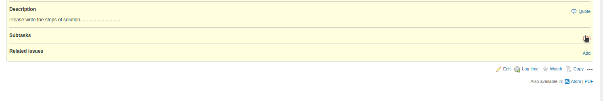

# How to create Ticket/Resolved/Closed in redmine?  
 

### First step:

Enter the IP address in the URL:  http://pems.keenable.io:3000/login

Then redirect on redmine login page.

### Then,
Login ID: "Company Email ID" 

Default password is :  

### Then, Change the password.
redirect on the change password page.

Then, you can change password.

### After the change password, Login again .
 

### Click on Projects tab.
 

### Then, Click on "Document_Team" Project.

### Now you are into the "Document_Team" page.

### Click on "Issues" tab.

### Then, click on "New Issues" buttion.

### Now you are on the Ticket rases (New issue) page.

### Select Statues of Ticket(new).

###  Select Assignee name.

### Click on "Create buttion".

### Now, Your ticket is created.

### Now, Here you can add sub-task.

Click on sub task button.

### Now, you can fill details of sub task here.

### Now, you can add also Sub task inside sub task.

Click on Add button.

### Click on Issue tab and see all list of ticket here.

### Now, How to change statue of ticket.
then, click on "subject" of issue.

### Now, Click on Edit buttion.

### Now, we can change the status(Inprogress).
Then, select status "New to Inprogress".

Then, click on "Save" buttion.

### Now, we can change the status "Resolved".
Again, Open same isses page.

Then, Click on "Edit" buttion.

Then, Select Status "Inprograss to Resolved".

Then, Click on "Save" buttion.

### Now, We can change the status "Cloesd ".
Again, Open same isses page.

Then, Click on "Edit" buttion.

Then, Select Status "Resolved to Closed ".

Then, Click on "Save" buttion.

 

